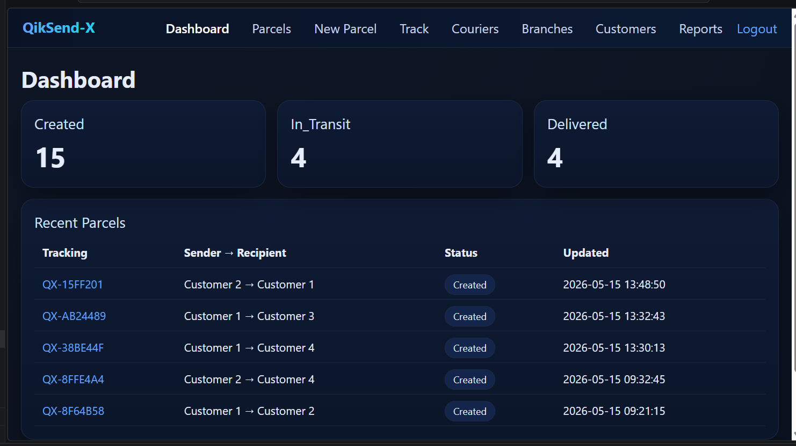
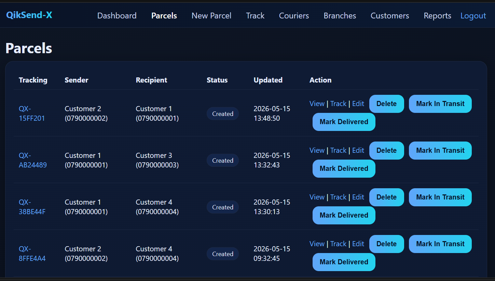
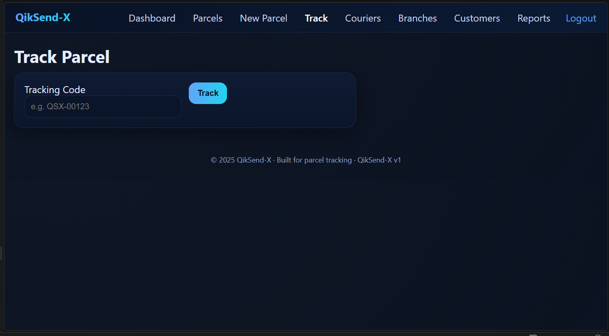
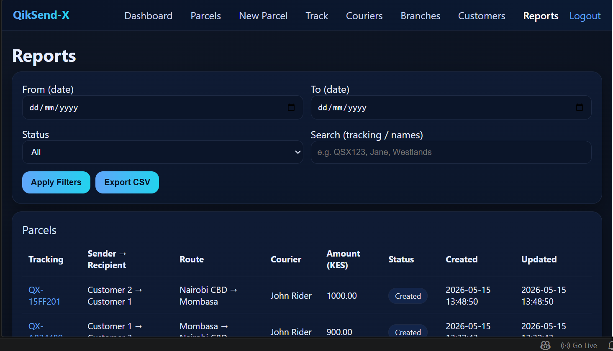

# QikSend-X — Logistics & Courier Management Platform

QikSend-X is a practical logistics and parcel management platform designed to support courier operations, parcel tracking, branch coordination, and delivery workflow management for SMEs and growing logistics businesses.

Built by Kwetu Partners Ltd, the system focuses on operational visibility, structured workflows, delivery tracking, and scalable dispatch operations.

---

# 🚀 Overview

QikSend-X provides a complete operational workflow for managing parcel movement across courier and branch networks.

The platform supports:

- Parcel registration and tracking
- Courier assignment workflows
- Branch-based logistics operations
- Delivery status management
- Customer shipment visibility
- Operational reporting and tracking

The system is designed around real-world operational simplicity rather than unnecessary enterprise complexity.

---

# Why QikSend-X Exists

QikSend-X was created to address the operational inefficiencies commonly found in small and medium logistics businesses.

Many courier and dispatch operations still rely on:
- manual tracking books
- phone-based coordination
- fragmented branch communication
- delayed shipment visibility
- inconsistent delivery records

Kwetu Partners designed QikSend-X to provide a practical and affordable operational platform that improves logistics visibility, accountability, and workflow structure.

The platform follows a Monozukuri-inspired engineering philosophy focused on:

- operational clarity
- workflow simplicity
- reliability-first engineering
- scalable business operations
- reduction of operational waste

---

# 🧠 Core Features

## Parcel Registration
Create and manage parcel delivery records through structured workflows.

## Shipment Tracking
Track parcel movement and delivery progress across operational stages.

## Courier Assignment
Assign deliveries to specific couriers and manage delivery responsibility.

## Branch Management
Support multi-branch logistics operations with structured routing workflows.

## Delivery Status Updates
Track operational states including:
- Created
- In Transit
- Delivered

## Customer Management
Manage sender and recipient information within the logistics workflow.

## Reporting & Visibility
Monitor delivery operations and shipment activity through operational dashboards.

## Mobile-Responsive Interface
Optimized for desktop and mobile operational use.

---

# 🏗️ System Architecture

QikSend-X follows a modular Flask-based architecture designed for operational simplicity and maintainability.

## Frontend
- HTML
- CSS
- Responsive UI Design

## Backend
- Python
- Flask Framework

## Database
- SQLite (development environment)
- PostgreSQL-ready architecture for production scaling

## Deployment
- Render deployment support
- Docker-ready structure
- Railway-compatible deployment architecture

---

# 📸 Screenshots

### Dashboard


### Parcel Management


### Tracking Workflow


### Reports & Operations


---

# 🛠️ Tech Stack

## Backend
- Python
- Flask

## Frontend
- HTML
- CSS

## Database
- SQLite

## Deployment & Infrastructure
- Render
- Docker
- Railway

---

# ⚙️ Installation

## 1. Clone Repository

```bash
git clone https://github.com/kwetu-stack/QikSend-X.git
cd QikSend-X
2. Create Virtual Environment (Windows)
python -m venv .venv
.venv\Scripts\activate
Mac / Linux
source .venv/bin/activate
3. Install Requirements
pip install -r requirements.txt
4. Run Application
python app.py
5. Access System
http://127.0.0.1:5000
💼 Operational Workflow
Parcel Creation

Register sender, recipient, destination branch, and shipment details.

Courier Assignment

Assign parcels to delivery personnel for operational tracking.

Shipment Tracking

Track parcel progression through operational delivery stages.

Delivery Confirmation

Update delivery states and maintain shipment history records.

Reports & Visibility

Monitor delivery operations through structured reporting tools.

🌐 Live Demo

Public Demo:
https://kwetupartners.net/live-demo.html

The public demo allows users to interact with the logistics workflow in a controlled sandbox environment.

📈 Roadmap
v1.1
Improved parcel analytics
Delivery performance metrics
Enhanced branch workflows
v2.0
Full multi-tenant logistics SaaS deployment
PostgreSQL production infrastructure
Centralized operational administration
v2.1
SMS delivery notifications
Customer shipment updates
Route optimization support
Future Vision
Fleet management integration
Driver mobile workflows
Real-time delivery tracking
Advanced logistics analytics
🏢 About Kwetu Partners

Kwetu Partners Ltd is a Kenyan software engineering company focused on practical operational systems for SMEs.

The company combines real-world operational experience with modern software engineering to build reliable, affordable business platforms across:

Inventory Management
Logistics & Dispatch
Finance & Bookkeeping
Construction Management
Education Technology
Identity & Access Systems

Kwetu follows a Monozukuri-inspired engineering philosophy centered on craftsmanship, operational clarity, and long-term system reliability.

Website:
https://kwetupartners.net/

📄 License

MIT License — Free to use, modify, and distribute.

🌍 Built in Kenya

Designed and engineered by Kwetu Partners Ltd.

Built with a focus on solving real operational challenges faced by SMEs across emerging markets.